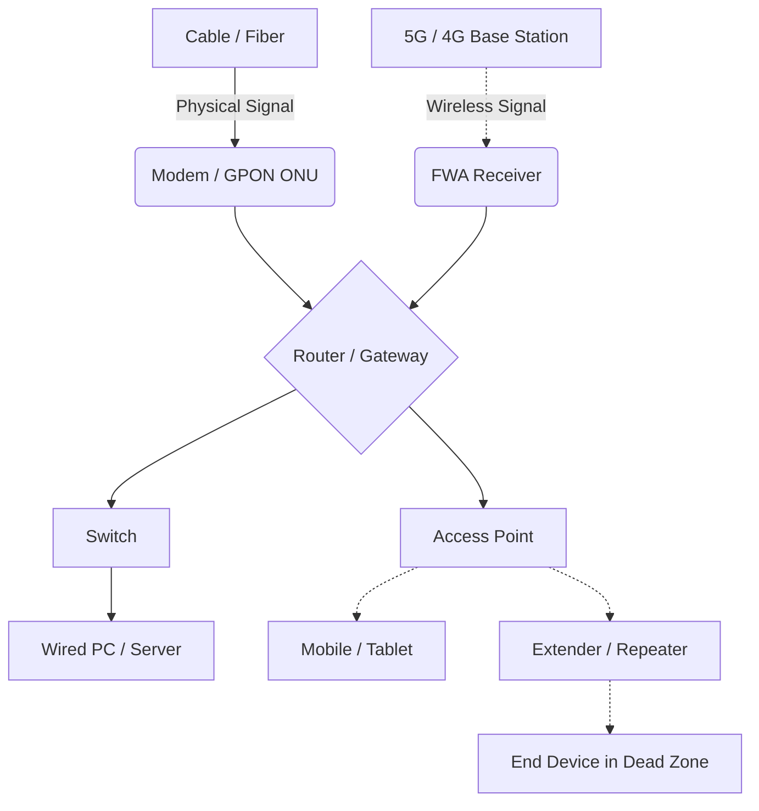

# The Network 101: The Foundation

Hi all, this is the first article in a series of network introduction. In this post, I'll briefly introduce the basic network communication using a simple CPE (Customer Premises Equipment) connection flow to illustrate the idea. 

<!-- more -->

Back in my "pure software" era, my team and I did not care much about the network infrastructure. We focused almost entirely on the application layer, assessing whether our cloud infrastructure could maintain top-notch performance during request floods and ensuring our interfaces are seamless.

We only looked back deep if we encountered a 500, 404 or similar error message. However, as we move into an increasingly connected world, understanding these "basics" has become essential. 

So, how well do you know your network?

***Keywords: #OSIModel #PacketEncapsulation***
## OSI Model
The Open System Interconnection (OSI) model is the most commonly used framework for understanding network communications. By understanding the stack, you'll know how one message travels from one end to another. 

The table below provides a brief overview of how OSI layers are structured: 

The human-computer interaction, such as a typical "browser search" behaviour, occurs in the application layer. Once the request is sent, it will go from the application layer all the way to the physical layer before being routed to its destination. Along the way, the message is being wrapped with multiple "headers" through a process called "encapsulation": 
> `<Message>` 
> ⬇ `[TCP/UDP Header <Message>]`  
> ⬇ `[IP Header [TCP/UDP Header <Message>]]` 
> ⬇ `[Ethernet Header [IP Header [TCP/UDP Header <Message>]]] [Ethernet Footer]` 

As the data moves through these layers, it is systematically divided into segments, packets, frames and eventually into bits, which are converted into signals (radio, optical or electrical pulses)for transmission accross the medium.

Once the message reaches its destination, the process is reversed: the data moves from the physical layer up to the application layer. At this stage, the "headers" are peeled off (decapsulated), and the fragmented data is reassembled into its original form for the browser to render and display to the end-users. 

> `<Message>` 
> ⬆ `[TCP/UDP Header <Message>]` 
> ⬆ `[IP Header [TCP/UDP Header <Message>]]` 
> ⬆ `[Ethernet Header [IP Header [TCP/UDP Header <Message>]]] [Ethernet Footer]` 

These two fundamental flows describe exactly how network communication works with messages (request and response) travel from end to end.

## CPE Connection Flow

So how does this process play out in a real-life scenario with actual hardware devices? 

Here is a quick recap of a typical home network setup. I have combined the two main types of connection, fixed line and mobile broadband, into the diagram below. 

### **Fixed Line (Wired)**
"Fixed Line" refers to a network established using physical cables. Depending on the technology used by your Internet Service Provider (ISP), it could be either cable or fiber. 

- Cable or copper cable is often used by operators who repurpose the existing telephone or TV coaxial cables to provide Internet services. 

- Fiber optical is using light pulses to transmit data. Fiber to the home (FTTH) is a popular high-speed solution with optimal throughput and low latency. Yet, it is also pricier as you need to deploy the specific infrastructure required.

Then, we will use modem or GPON ONT to receive physical signals from ISP,and convert those signals into digital ones.

### **Mobile Broadband (Wireless)**
As the name suggests, the network service is provided through mobile network such as 5G or 4G LTE base station. 

To use this at home, users have to setup devices like fixed wireless access (FWA) router. These devices use sim or esim card to capture cellular signals, and then translate the connectivity into a Wi-Fi network via a built-in Access Point.

*Note: in the real world, it often has the modem/GPON ONU/FWA, router, gateway, switch/ access point in one device.*

### Step-by-step network connections via CPEs

1. **Client layer 7:** User triggers a request on the browser. For example, to open the "www.amazon.com", the system first uses Domain Name System (DNS) to look up the destination IP before an HTTPS connection could be established. 
> *If Amazon uses Content Delivery Network (CDN) service (they do btw), then CDN services like Cloudflare or Akamai will allocate the optimal desitination IP (response time) based on factors like traffic, latency, server load and geographic location.*
2. **Client layer 6:** With the destination IP, the message will be processed by the presentation layer handling tasks like encryption (SSL/TLS), compression,and data translation.
3. **Client layer 5:** Once prepared, the message moves to the session layer which manages the communication session between local and remote hosts.
4. **Client layer 4:** The TCP handshake is triggered for establishing a reliable conneciton. The message is then divided into segments, each with a TCP header containing the source port, destiniation port, sequence number and checksum.
5. **Client layer 3:** Move on to the Network layer where the message is further divided into packets with an IP header which includes the source IP, destiniation IP, and checksum. 
6. **Client layer 2:** In the data link layer, the message is again divided into frames with ethernet (or Wi-Fi) header and footer. This layer requires source and destination MAC addresses. Since the message usually needs to travel to the WAN (Internet) rather than staying on the local network (LAN), the client machine uses Address Resolution Protocol (ARP) to find the MAC address of the default gateway (the router).
7. **Client layer 1:** The frames are converted into bits and then electrical signals for transmitting data to the next physical device. In this case, the router. 
8. **Network In-between steps:** If there is a **switch** or **AP**, the device will decapsulate the message to layer 2 to verify the MAC address before forwarding to the router. 
9. **Router:** The router decapsulates the message up to layer 3 to inspect the desitnation IP address. If a match is found in its routing table, it forward the message. If not, it will route the message to the ISP Gateway. The above "routing behaviour" will have the router replaces the source/ destination MAC address in the message. 
    - **Firewall:** normally, we will have the router with firewall. The firewall verifies the message against security rules. If it uses a forbidden port or IP, the message will be dropped. 
    - **Network Address Translation (NAT):** If the message is going out of the LAN, the private source IP will be replaced to a shared public IP assigned by the ISP.
    - After all the potential message updates, the **Time to Live (TTL)** value in the header will be decremented by 1 following with the recalculation of the checksum. 
10. **Repeating steps:** The message will be sent to the modem or ONU then converting into physical signals to other devices until it reaches the destination.
11. **Server end process:** Once the message reaches the destination IP, the message will go through the decapsulation process. In this case, the "amazon.com" server will receive the request and send back a response with data for displaying the amazon.com at the client end. Then the process repeats until the interaction ends.

## Conclusion
We have become so accustomed to the fast and smooth network communication. Data appears within milliseconds on our screens as if by magic. However as we explored, it is actually a highly structured process of encapsulation and decapsulation.

Understanding the underlying mechanisms of the network communication is just the beginning. You might wonder how does the Wi-Fi 7 and upcoming 6G relate to us? What do those names actually mean for us?

In the next post, I'll dive into the 3GPP and Wi-Fi standards to give a clearer picture of the future of connectivity. 

Stay tuned!

---
### Reference
- [Cloudflare](https://www.cloudflare.com/zh-tw/learning/ddos/glossary/open-systems-interconnection-model-osi/)
- [Google IT Support/ Coursera](https://grow.google/certificates/it-support/)
