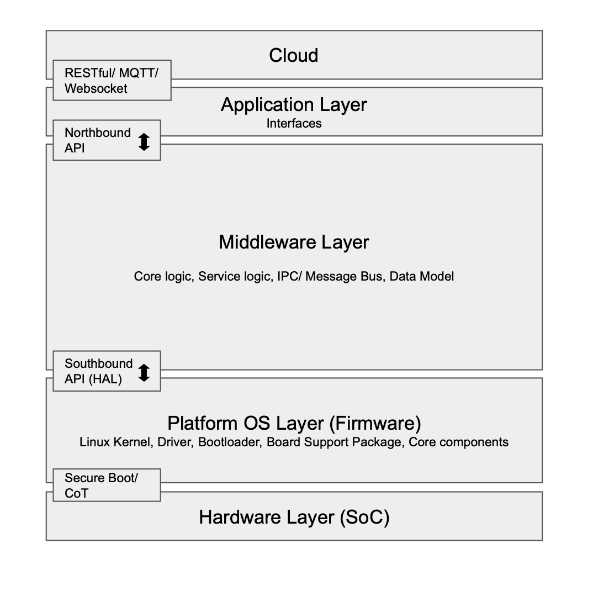
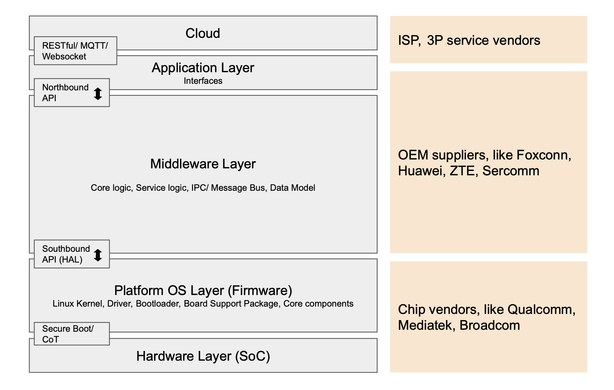
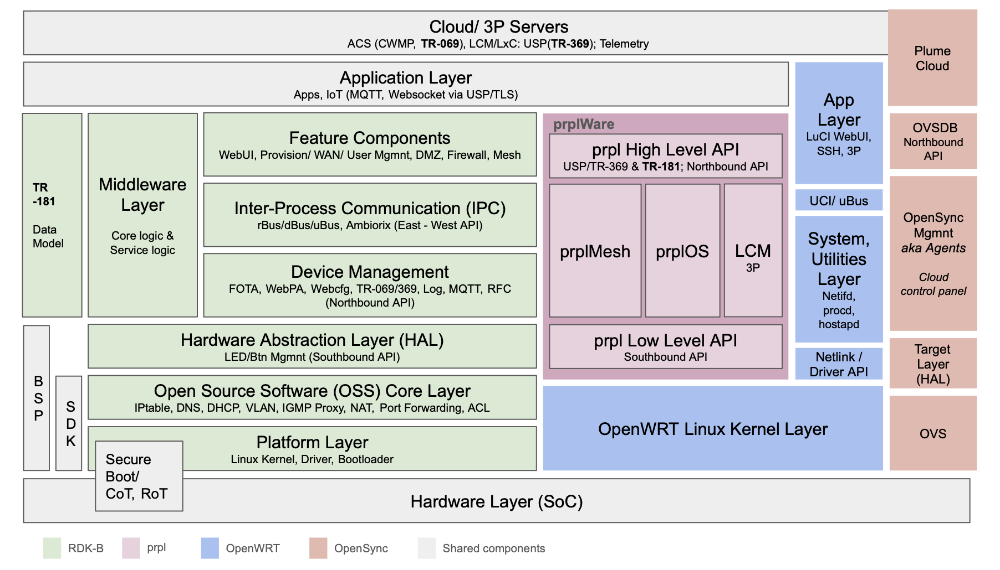

# Network 101: The Brain of CPEs

Now that we have a basic understanding of how data is transmitted through the OSI model and how wireless technologies have evolved over the past decades, I'd like to turn the focus back to the CPE.

<!-- more -->

To most users, the role of a router is simply providing the Internet access. However based on the standards, we learn that it can do much more than a Wi-Fi access point. With the proper hardware and embedded chipset, it can support features including: 

- Managed Quality of Services
- Target Wake time, TWT
- Encryption (WPA3 etc.)
- Private network
- Voice over IP
- Mesh 

The scope of these features goes beyond physical and data link layers. As the last mile of the Internet deployment, how does the CPE evolve alongside wireless technology? Let's dig deeper!

***Keywords: #OpenWRT #prpl #RDKB #OpenSync #SDN***

## The Modern Structure of a Connected Device
Companies constantly compete for market dominance, striving to become the industry standard. A famous example is the battle between 4G WiMAX v.s. LTE, led by Intel and mobile operators respectively. The profit behind the "winner takes all" is a powerful incentive, driving companies to invest big. Yet, this often leads to fragmented landscape with tons of vendor-specific standards that lack interoperability.

High development cost has not only stifled the maket growth, and ultimately degraded the user experience. To address this, there is a growing trend in the CPE & ISP market to adopt the "modular" and "microservices" methodologies that has been the backbone of the software industry. 

Before we dive into the impact, let's have a quick recap on how a connected device stacked. 

In my previous experience building platform strategies for smart lighting, the structure followed a similar but simpler logic. For example: the bulb uses a vendor's SoC and embedded SDK which includes the bootloarder, flash partitions for binaries, and core drivers. Then, our own SDK (or multiple SDKs) will be integrated on the top of chip vendor's stack to implement the "brand-specific" features. 

These features ranges from defined manufactured Out-the-the-box (OOTB) behaviour, IoT data collection to edge computing, and management related agents. Finally, those configuration or collected data will be saved locally and synchronized with the cloud. User interfaces will update the configuration table later via the Cloud API. We can discuss more on this case in the next post about smart home.

In the context of a CPE, the logic remains consistent with the previous example. However, due to its complexity (at least compared to smart bulbs), the architecture requires distinct communication layers. This includes southbound API (often implemented as hardware abstraction layer, HAL) for communicating with the hardware layer, and northbound API for interacting with the cloud and user interfaces. This separation is crucial for maintaining a flexible, scalable and efficient network structure.

Among all layers, the middleware is what defines the control and behaviour of a device. Historically, the CPE development in the real world has followed the flow as:

1. Select chip vendor based on the feature list and cost target; every vendor has its own SoC and SDK design
2.  OEM bridges the proprietary vendor chipset with its own specific middleware 
3.  Above the middleware, OEM creates API to connect with assigned cloud services, such as an ISP's auto configuration server (ACS)
4.  ISP primarily handles the user verification and add-on services to end-users

In this structure, the actual brand owners have the least control. While they define features and validate the finished goods to ensure the quality, any minor adjustments depends heavily on the OEMs and chip vendors. The dependency makes it difficult to iterate or deploy advanced features after the initial release. Consequently, more operators are now choosing to build in-house software team or embrace open source frameworks to regain control over their product roadmap. 

## Key Frameworks & Standards

> I tried to put all 4 frameworks (RDK-B, prpl, OpenWRT, and OpenSync) in one diagram to understand the differences.

### OpenWRT, 2004

First of all, the most popular open source framework at CPE: OpenWRT. It's a lightweight, flexible, and intuitive Linux-based operating system for embedded devices. For developers, it eliminates the need to reinvent the wheel (firmware), allowing them to focus entirely on the key features. For users, it means the ability for full customization. 

- **OpenWRT Linux Kernel Layer**: The engine of the framework
- **Unified Configuration Interface (UCI)**: The standardized control center for system settings
- **LuCI**: WebUI based on Lua

OpenWRT provides all the essential and powerful tools for building a CPE. Unlike vendor-locked products which often come with short and limited support, this robust OSS community ensures long term maintenance and feature updates. Beyond DIY users, SoC providers like Qualcomm, Mediatek have released chips based on OpenWRT. Even today, millions of commercial CPE worldwide operate on the OpenWRT framework.

However from ISP's perspective, OpenWRT is not always compact enough to meet the rigorous demands of a large-scale industrial deployment. 

### TR-XXX standards by Broadband Forum (BBF)
In 1994, the ADSL Forum was founded; it was later renamed to the Broadband Forum (BBF) in 2008. As the names suggest, the organization focuses on ISP-related topics.

The BBF released the landmark "**TR-069 (CPE WAN Management Protocol, CWMP)**" standard for ACS which ISPs use to remotely control/ configure CPEs at the end-user side. This structure is still used today by many operators.

To meet modern demands, BBF later released "**TR-369  (User Service Platform, USP)**" in 2018 to succeed TR-069. The new standard supports the architecture for Lifecycle Management (LCM) and Linux Container Management (LxC/LxM) concept, allowing for a more modular and service-oriented approach. You can think of this as "app management" for the CPEs. Just as you update or delete an app on your smartphone, ISP can now independently manage specific services without reflashing the entire firmware. With LCM and LxM, USP has gradually become the industry standard for next-generation CPEs. 

Additionally, they established "**TR-181**" as the standard data model for CPEs. This is heavily used in the northbound middleware communication, ensuring devices or agents are using the same language when exchanging network parameters. 

### RDK-B, 2013

While TR standards perfectly meet ISP's needs, the industry wanted a framework that combined OpenWRT with carrier-grade standardization. This led to the emergence of the "Reference Design Kit-Broadband (RDK-B)" backed by major operators in the US market. 

The pros and cons of this framework are distinct. It defines a thorough and robust technical stack that is highly modular and organized. It definitely achieves the goal of hardware-software decoupling, allowing operators to regain control over feature development and iteration. However, as expected, the learning curve and adoption costs are steep. Furthermore, the hardware requirements, particularly for the CPU, are significantly higher than those lightweight frameworks. 

RDK-B is a good fit for telecom giants, and is supported by industry leaders including Charter, Comcast, and T-mobile. But it would not be a friendly option for smaller operators with fewer resources. 

*Note: Compared to other frameworks, RDK-B offers the most comprehensive support for **DOCSIS**, largely due to the nature of its member pool.* 

### prpl, 2014
Prpl foundation was founded in 2014, then released its renowned prplOS in 2018. What prpl aims to achieve is identical to the goals we previously discussed. But this time, they chose to combine the low layer engine of OpenWRT with a redesigned decoupling middleware based on BBF standards. The structure consists of:
- High level API (northbound API)
- prplOS
- prplMesh
- LCM
- Low Level API (southbound API)

The development of prpl is strongly driven by global operators like Orange and Deutsche Telekom. For those who used OpenWRT as their CPE foundation, prpl provides a seamless transition to a more secure, flexible and standardized framework. Today, prpl is gaining more traction with many ISPs listing it as a mandatory requirement in the RFQ (Request for Quotation). 

### Hardware Offload Engine or Hardware Processing Unit (HPU)

As discussed above, the industry trend is clearly evolving from monolithic architecture to microservices. However a significant side effect of the shift is the drastic spike in CPU demand. Looking back at the diagram, yup, we see multiple APIs facilitating cross-agent and cross-layer communication. Moreover, when considering Wi-Fi 7 (EHT) standards and 5G eMBB requirements for glitch-free streaming user experience, the current design is no longer sustainable. 

To fix this, HPU, a well-known hardware acceleration or hardware offload engine, has come to the discussion. The concept is straightforward: offload intensive workload from CPU to dedicated hardware. Engineers designed a "fast path" for requests successfully traverses the system end-to-end, any subsequent identical traffic should bypass the CPU entirely. 

For example:

- You request to access YouTube from your browser

- The message travels through layers as we described in the network fundamental article, including has the router changed the IP address, port number or any potential data along the way

- Hits the server end successfully, and returns to your browser for loading the resource of YouTube

- Once the path is verified, any identical request (open YouTube on my browser) afterwards should not cost any CPU resource but directly copy-paste the behavior of the verified path. 

*Just note, besides IP address updating, HPU also supports advanced features like VLAN tags, QoS management features required by the latest wireless standard.*

## Software-defined Network, SDN

For most software-centric companies, the traditional hardware development cycle is a pain point, often being described as "Slow Delivery Cycles, Low innovation". Unlike software development, which naturally supports the continuous integration and continuous deployment (CI/CD), hardware development is hindered by complex dependencies among multiple stakeholders. 

### OpenSync by Plume, 2018

Therefore, software companies like Plume decided to reshape the landscape by refactoring the architecture into a "Cloud Native" model. In essence, management features are migrated from the device to the cloud, taking the decoupling of hardware and software one step further. 

This architecture reverses the roles of device and cloud, centralizing all decision-making in the cloud. On the other hand, it reduces the role of the device from heavy edge computing workload to simple receive and execute. In addition, OpenSync is not intended to replace other frameworks; it is designed to integrate seamlessly with other platforms such as OpenWRT, RDK-B, and prpl.

With its "Cloud centralized control plane" design, OpenSync's capabilities expands far beyond LCM. It enables not only "App store like" update and maintenance, but also AI-driven dynamically control. 

For example, a firewall security service on OpenSync:

- The cloud identifies the potential attack pattern by analyzing the data collected from devices

- The cloud pushes the real-time command to all connected devices simultaneously

- The device receives and follows the instructions, updating its configuration immediately

- The device reports the status back to the cloud

At last, Plume had officially joined the prpl Foundation at the end of 2025. The decision forecasts an upcoming convergence between cloud-native structures and the ISP-centric design.

## Conclusion

Will there be a unified future for CPE frameworks? Based on current trends, the industry is moving steadily toward a more flexible, efficient, and cost-effect development path. According to BBF's [latest news release](https://www.broadband-forum.org/news/2026-02-19-obuspa-integrated-with-prpl-and-rdk/): the integration of the USP Agent (OBUSPA) with both prpl and RDK-B has reduced the development cycle from more than 9-18 months to as little as 2-4 weeks. That's an incredible leap in agility! 

Once the architechture is unified, where would be the next battlefield for ISPs or OEMs? I believe the competition will shift toward the add-on software services, including advanced IoT capabilities, AI-driven QoS, and highly customizable network features as we've seen in the software evolution. 

In the next post, I will share my experience on leading the Matter integration over millions in-field and newly manifactured smart lighting devices at Signify.

Stay tuned!

---
### Reference
- [RDK-B Architecture](https://wiki.rdkcentral.com/spaces/RDK/pages/175114230/Architecture#oss-core-layer)
- [OpenWRT](https://openwrt.org)
- [prpl](https://prplfoundation.org/prpl-publications/)
- [BBF: OBUSPA integrated with prpl and RDK](https://www.broadband-forum.org/news/2026-02-19-obuspa-integrated-with-prpl-and-rdk/)
- [OpenSync](https://opensync.atlassian.net/wiki/spaces/OCC/pages/40644116481/OpenSync+7.0+Feature+Designs)
- [Cloudflare: SDN](https://www.cloudflare.com/learning/network-layer/what-is-sdn/)
- [VMWare: SDN](https://www.vmware.com/topics/software-defined-networking)

